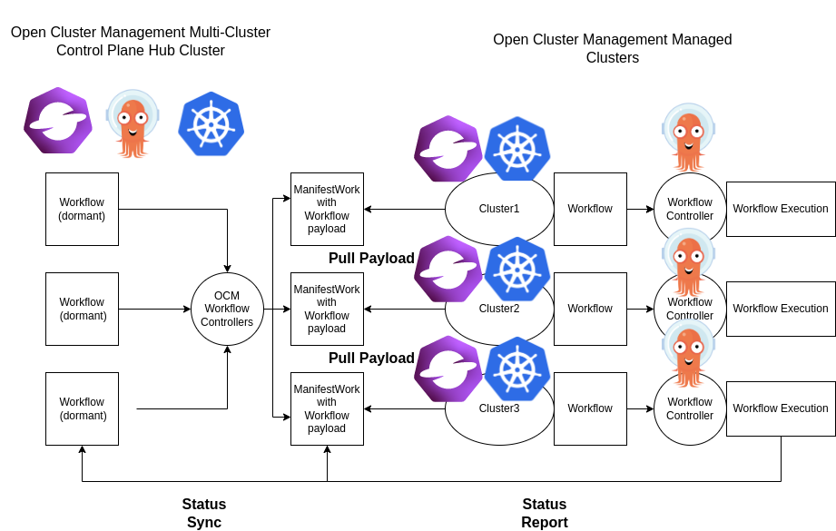

# Argo Workflow Multicluster
Experimental controllers that uses the [Open Cluster Management (OCM)](https://open-cluster-management.io/) 
APIs and components to enable Argo Workflow Multi-cluster capabilities.

**Note:** This is an experimental project and we welcome any community's feedback and suggestions.

## Description
By using this project, users can propgate Argo Workflow to remote clusters based on availabile cluster resource usages.



There are three controllers in this project.

- Workflow Placement controller watches the Workflow CR and evaluate the [Placement](https://open-cluster-management.io/concepts/placement/) decision then annotates the Workflow with the remote cluster target.
- Workflow ManifestWork controller watches the Workflow CR with the remote cluster target and create [ManifestWork](https://open-cluster-management.io/concepts/manifestwork/) CR which will propgate the Workflow to the intended remote cluster.
- Workflow Status controller that updates the Workflow CR status on the hub cluster with the remote cluster's Workflow's execution results.

See the [Workflow example](example/hello-world.yaml) for the required label and annotation.


## Dependencies
- The Open Cluster Management (OCM) multi-cluster environment needs to be setup. See the [OCM website](https://open-cluster-management.io/) on how to setup the environment.
- In this multicluster model, OCM will provide the cluster inventory and ability to deliver workload to the remote/managed clusters.
- The remote/managed clusters need to have Argo Workflow installed.

## Getting Started
1. Setup an OCM Hub cluster and registered at least one OCM Managed cluster.

2. On the managed cluster, install Argo Workflow.

3. On the managed cluster, elevate OCM agent to have permission to access the Workflow objects.
```
kubectl apply -f example/managed
``` 

3. On the hub cluster, install just the Argo Workflow CRD.
```
kubectl apply -f hack/crds/workflows_crd.yaml
```

4. On the hub cluster, clone this project and run the controllers:
```
export KUBECONFIG=/path/to/<hub-kubeconfig>
git clone ...
cd argo-workflow-multicluster
make run
```

6. On the hub cluster, apply the ManagedClusterSetBinding and Placement.
```
kubectl apply -f example/clusterset-binding.yaml
kubectl apply -f example/workflow-placement.yaml
```

7. On the hub cluster, create the example Workflow.
```
kubectl apply -f example/hello-world.yaml
```

8. On the managed cluster, check the Workflow that was executed.
```
kubectl get workflow
NAME                       STATUS      AGE     MESSAGE
hello-world-multicluster   Succeeded   3m52s
```

9. On the hub cluster, check the ManifestWork. Replace `cluster1` namespace value with your managed cluster name
```
kubectl -n cluster1 get manifestwork -o yaml
...
        statusFeedback:
          values:
          - fieldValue:
              string: Succeeded
              type: String
            name: phase
...
```

10. On the hub cluster, check the Workflow to see the status phase is now synced from the managed cluster.
```
kubectl get workflow
NAME                       STATUS      AGE     MESSAGE
hello-world-multicluster   Succeeded
```

## What's next

See the OCM [Extend the multicluster scheduling capabilities with Placement API](https://open-cluster-management.io/scenarios/extend-multicluster-scheduling-capabilities/) 
documentation on how to schedule workload based on available cluster resources.

## Community, discussion, contribution, and support

Check the [CONTRIBUTING Doc](CONTRIBUTING.md) for how to contribute to the repo.

### Communication channels

Slack channel: [#open-cluster-mgmt](https://kubernetes.slack.com/channels/open-cluster-mgmt)

## License

This code is released under the Apache 2.0 license. See the file [LICENSE](LICENSE) for more information.
